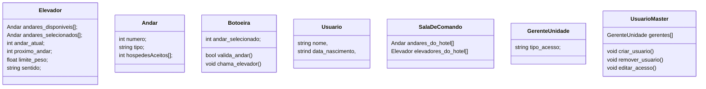

```mermaid
classDiagram

class Elevador{
    Andar andares_disponiveis[];
    Andar andares_selecionados[];
    int andar_atual;
    int proximo_andar;
    float limite_peso;
    string sentido;
}

class Andar{
    int numero;
    string tipo;
    int hospedesAceitos[];
}

class Botoeira{
    int andar_selecionado;
    bool valida_andar()
    void chama_elevador()
}

class Usuario{
    string nome,
    strind data_nascimento,
}

class SalaDeComando{
    Andar andares_do_hotel[]
    Elevador elevadores_do_hotel[]
}

class GerenteUnidade {
    string tipo_acesso;
}

class UsuarioMaster{
    GerenteUnidade gerentes[]
    void criar_usuario()
    void remover_usuario()
    void editar_acesso()
}
```