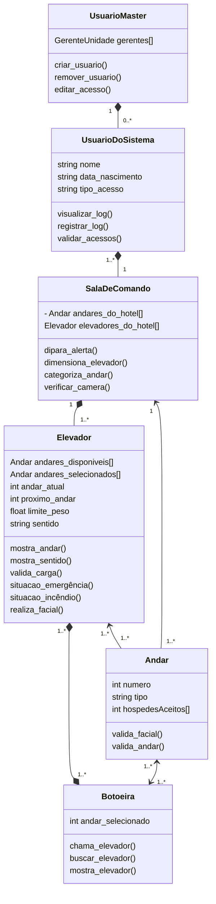

```mermaid
classDiagram

class Elevador{
    Andar andares_disponiveis[]
    Andar andares_selecionados[]
    int andar_atual
    int proximo_andar
    float limite_peso
    string sentido
    mostra_andar()
    mostra_sentido()  
    valida_carga() 
    situacao_emergência()
    situacao_incêndio()   
    realiza_facial()
}

class Andar{
    int numero
    string tipo
    int hospedesAceitos[]
    valida_facial()
    valida_andar()
}

class Botoeira{
    int andar_selecionado
    chama_elevador()
    buscar_elevador()
    mostra_elevador()
}

class UsuarioDoSistema{
    string nome
    string data_nascimento
    string tipo_acesso
    visualizar_log()
    registrar_log()
    validar_acessos()
}

class SalaDeComando{
    - Andar andares_do_hotel[]
    Elevador elevadores_do_hotel[]
    dipara_alerta()
    dimensiona_elevador()
    categoriza_andar()
    verificar_camera()
}

class UsuarioMaster{
    GerenteUnidade gerentes[]
    criar_usuario()
    remover_usuario()
    editar_acesso()
}

UsuarioMaster "1" *-- "0..*" UsuarioDoSistema
UsuarioDoSistema "1..*" *-- "1" SalaDeComando
SalaDeComando "1" *-- "1..*" Elevador
SalaDeComando "1" <-- "1..*" Andar
Elevador "1..*" *--* "1..*" Botoeira
Andar "1..*" <--> "1..*" Botoeira
Elevador "1..*" <-- "1..*" Andar
```