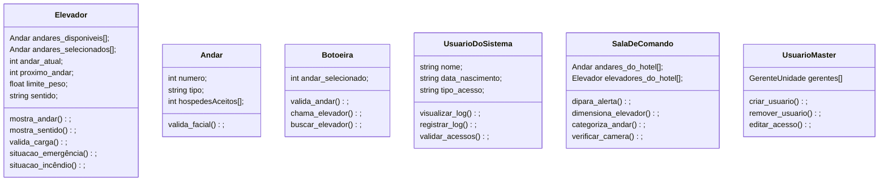

```mermaid
classDiagram

class Elevador{
    Andar andares_disponiveis[];
    Andar andares_selecionados[];
    int andar_atual;
    int proximo_andar;
    float limite_peso;
    string sentido;
    mostra_andar();
    mostra_sentido();  
    valida_carga(); 
    situacao_emergência();
    situacao_incêndio();   
}

class Andar{
    int numero;
    string tipo;
    int hospedesAceitos[];
    valida_facial();
}

class Botoeira{
    int andar_selecionado;
    valida_andar();
    chama_elevador();
    buscar_elevador();
}

class UsuarioDoSistema{
    string nome;
    string data_nascimento;
    string tipo_acesso;
    visualizar_log();
    registrar_log();
    validar_acessos();
}

class SalaDeComando{
    Andar andares_do_hotel[];
    Elevador elevadores_do_hotel[];
    dipara_alerta();
    dimensiona_elevador();
    categoriza_andar();
    verificar_camera();
    
}


class UsuarioMaster{
    GerenteUnidade gerentes[]
    criar_usuario();
    remover_usuario();
    editar_acesso();
}
```